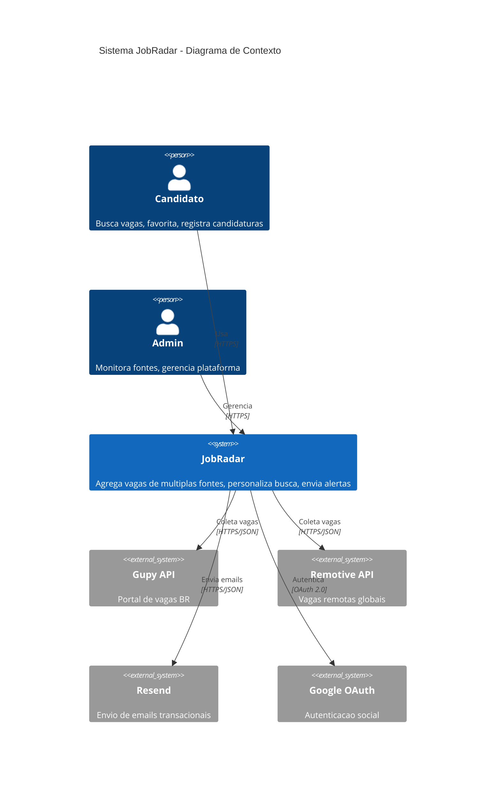
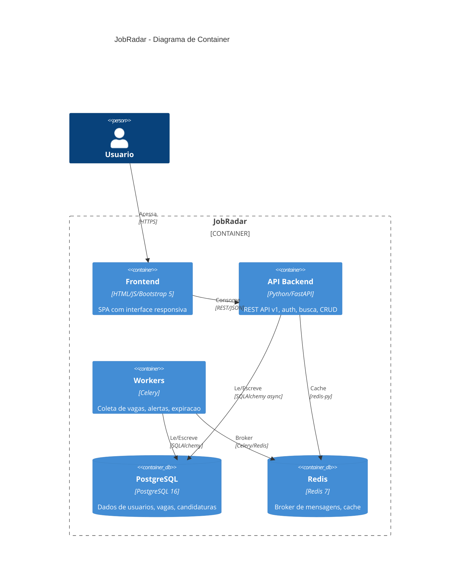
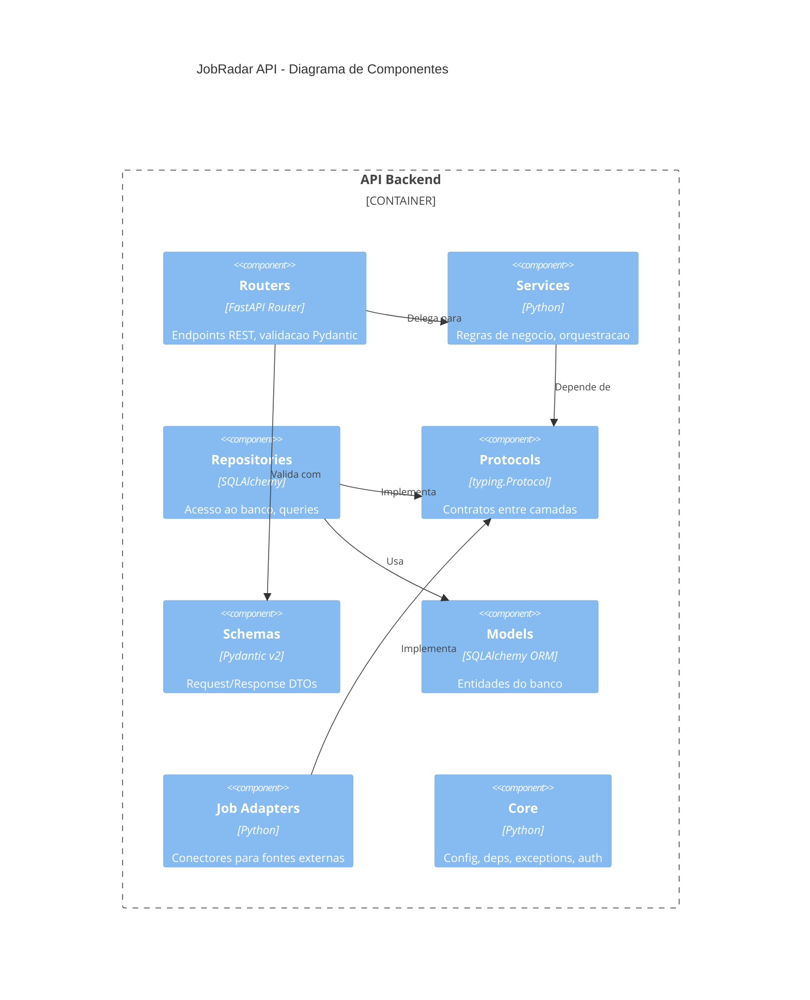
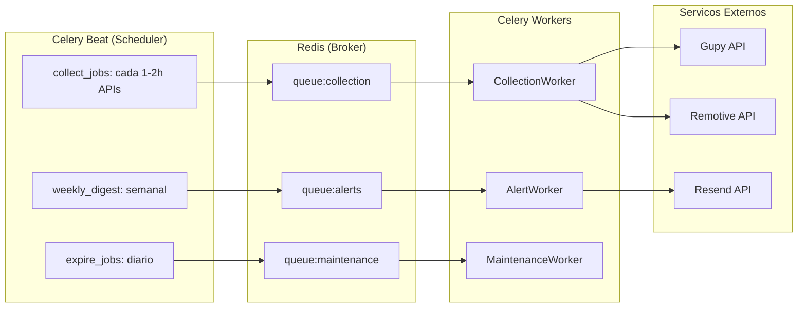
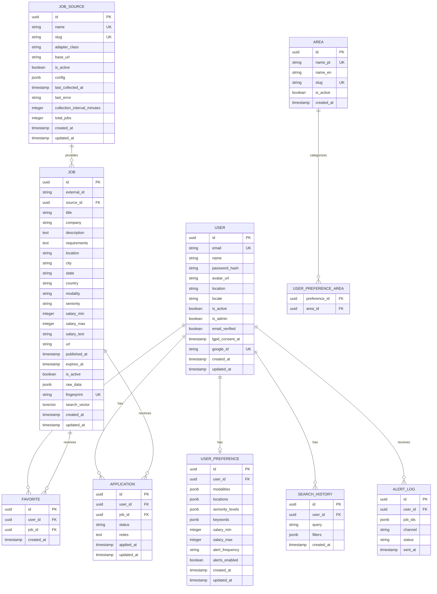

# ARCHITECTURE.md -- JobRadar

> **Versao:** 1.0 | **Data:** 2026-04-04 | **Status:** Em desenvolvimento

---

## 1. Resumo Executivo

JobRadar e um sistema web para busca centralizada de vagas de emprego no Brasil e remotas globalmente. Agrega vagas de multiplas fontes externas (Gupy, Remotive), normaliza e deduplica resultados, personaliza busca com base em preferencias do usuario e oferece tracking de candidaturas com alertas por email. Publico-alvo: candidatos ativos e profissionais em transicao de carreira, com foco no mercado brasileiro.

---

## 2. Stack Tecnica

| Componente | Tecnologia | Versao | Justificativa |
|---|---|---|---|
| Runtime | Python | 3.12 | Padrao do time, typing avancado, performance melhorada |
| Framework | FastAPI | 0.115+ | Async nativo, OpenAPI auto-gerado, Pydantic v2 integrado |
| Banco | PostgreSQL | 16 | Padrao do time, tsvector para full-text, JSONB para dados flexiveis |
| ORM | SQLAlchemy (async) | 2.0+ | Async support, type hints, mapped_column |
| Migrations | Alembic | 1.13+ | Padrao com SQLAlchemy, auto-generate |
| Cache/Broker | Redis | 7+ | Broker para Celery, cache de buscas frequentes |
| Task Queue | Celery | 5.4+ | Workers distribuidos, beat scheduler, integracao Redis |
| Email | Resend (Python SDK) | 2.0+ | API moderna, batch sending, 100/dia gratis, SDK tipado |
| Auth | python-jose + passlib[bcrypt] | latest | JWT HS256, bcrypt cost 12 |
| Validacao | Pydantic | 2.0+ | Integrado com FastAPI, performance melhorada |
| Testes | pytest + pytest-asyncio + httpx | latest | Async testing, TestClient |
| Lint | ruff + mypy --strict | latest | Rapido, type checking rigoroso |
| i18n | python-i18n | latest | Simples, YAML-based, PT-BR + EN |
| Containerizacao | Docker + Docker Compose | latest | Padrao do time |
| HTTP Client | httpx | latest | Async, para chamadas a APIs externas |

---

## 3. Arquitetura

### 3.1 Visao Geral (C4 - Contexto)



### 3.2 Containers (C4 - Container)



### 3.3 Componentes (C4 - Component)



### 3.4 Clean Architecture -- Regra de Dependencia

```
[HTTP Request] --> Router --> Service --> Repository --> [PostgreSQL]
                    |            |            |
                Pydantic     Domain       ORM/SQL
                Schemas      Logic        Queries
                    |            |            |
                 <= 5 linhas  TODA logica  TODO banco
                              SEM ORM     SEM logica
                              SEM HTTP    Retorna domain
```

**Regras inegociaveis:**

- **Router/Controller:** max 5 linhas. Valida (Pydantic) + chama service + retorna response. ZERO SQL, ZERO regra de negocio.
- **Service:** TODA regra de negocio. Sem imports de ORM (`from sqlalchemy` = violacao). Sem HTTP status codes. Usa excecoes de dominio.
- **Repository:** TODO acesso ao banco. Sem regras de negocio. Retorna domain objects, nao ORM models crus.
- **Protocol:** Contratos entre camadas. Services dependem do Protocol, nao da implementacao concreta.
- **Imports SEMPRE apontam para dentro:** router -> service -> repo. Nunca o contrario.

### 3.5 Workers -- Arquitetura de Filas



**Filas:**
| Fila | Workers | Concorrencia | Proposito |
|---|---|---|---|
| collection | 2 | 1 por fonte | Coleta e normalizacao de vagas |
| alerts | 1 | 4 | Matching de preferencias + envio de email |
| maintenance | 1 | 1 | Expiracao, limpeza, metricas |

---

## 4. Modelos de Dados

### 4.1 ERD



### 4.2 Entidades Detalhadas

#### User

| Campo | Tipo | Constraints | Descricao |
|---|---|---|---|
| id | UUID | PK, NOT NULL, DEFAULT gen_random_uuid() | Identificador unico |
| email | VARCHAR(255) | UNIQUE, NOT NULL | Email do usuario |
| name | VARCHAR(150) | NOT NULL | Nome completo |
| password_hash | VARCHAR(255) | NULL (OAuth users) | Hash bcrypt cost 12 |
| avatar_url | VARCHAR(500) | NULL | URL da foto de perfil |
| location | VARCHAR(255) | NULL | Localizacao do usuario |
| locale | VARCHAR(5) | NOT NULL, DEFAULT 'pt-br' | Idioma preferido (pt-br, en) |
| is_active | BOOLEAN | NOT NULL, DEFAULT TRUE | Conta ativa |
| is_admin | BOOLEAN | NOT NULL, DEFAULT FALSE | Administrador |
| email_verified | BOOLEAN | NOT NULL, DEFAULT FALSE | Email confirmado |
| lgpd_consent_at | TIMESTAMP | NULL | Data do consentimento LGPD |
| google_id | VARCHAR(255) | UNIQUE, NULL | ID do Google OAuth |
| created_at | TIMESTAMP | NOT NULL, DEFAULT NOW() | Data de criacao |
| updated_at | TIMESTAMP | NOT NULL, DEFAULT NOW() | Data de atualizacao |

#### Job

| Campo | Tipo | Constraints | Descricao |
|---|---|---|---|
| id | UUID | PK, NOT NULL | Identificador unico |
| external_id | VARCHAR(255) | NOT NULL | ID na fonte original |
| source_id | UUID | FK -> job_source.id, NOT NULL | Fonte da vaga |
| title | VARCHAR(500) | NOT NULL | Titulo da vaga |
| company | VARCHAR(255) | NOT NULL | Nome da empresa |
| description | TEXT | NOT NULL | Descricao completa |
| requirements | TEXT | NULL | Requisitos |
| location | VARCHAR(255) | NULL | Localizacao textual |
| city | VARCHAR(100) | NULL | Cidade |
| state | VARCHAR(100) | NULL | Estado/provincia |
| country | VARCHAR(100) | NULL | Pais |
| modality | VARCHAR(20) | NULL | presencial, remoto, hibrido, home_office, freelance |
| seniority | VARCHAR(20) | NULL | estagio, junior, pleno, senior, especialista, gestao |
| salary_min | INTEGER | NULL | Salario minimo (centavos) |
| salary_max | INTEGER | NULL | Salario maximo (centavos) |
| salary_text | VARCHAR(100) | NULL | Texto original do salario |
| url | VARCHAR(1000) | NOT NULL | URL original da vaga |
| published_at | TIMESTAMP | NULL | Data de publicacao na fonte |
| expires_at | TIMESTAMP | NULL | Data de expiracao |
| is_active | BOOLEAN | NOT NULL, DEFAULT TRUE | Vaga ativa |
| raw_data | JSONB | NULL | Dados originais da fonte |
| fingerprint | VARCHAR(64) | UNIQUE, NOT NULL | SHA256 para deduplicacao |
| search_vector | TSVECTOR | NULL | Vetor de busca full-text |
| created_at | TIMESTAMP | NOT NULL | Data de insercao |
| updated_at | TIMESTAMP | NOT NULL | Data de atualizacao |

#### JobSource

| Campo | Tipo | Constraints | Descricao |
|---|---|---|---|
| id | UUID | PK | Identificador unico |
| name | VARCHAR(100) | UNIQUE, NOT NULL | Nome da fonte (ex: "Gupy") |
| slug | VARCHAR(50) | UNIQUE, NOT NULL | Slug (ex: "gupy") |
| adapter_class | VARCHAR(255) | NOT NULL | Classe Python do adapter (ex: "adapters.gupy.GupyAdapter") |
| base_url | VARCHAR(500) | NOT NULL | URL base da API/site |
| is_active | BOOLEAN | NOT NULL, DEFAULT TRUE | Fonte ativa para coleta |
| config | JSONB | NULL | Configuracoes especificas (headers, params, etc) |
| last_collected_at | TIMESTAMP | NULL | Ultima coleta bem-sucedida |
| last_error | TEXT | NULL | Ultimo erro de coleta |
| collection_interval_minutes | INTEGER | NOT NULL, DEFAULT 120 | Intervalo entre coletas |
| total_jobs | INTEGER | NOT NULL, DEFAULT 0 | Total de vagas coletadas |
| created_at | TIMESTAMP | NOT NULL | Data de criacao |
| updated_at | TIMESTAMP | NOT NULL | Data de atualizacao |

#### Application (Candidatura)

| Campo | Tipo | Constraints | Descricao |
|---|---|---|---|
| id | UUID | PK | Identificador unico |
| user_id | UUID | FK -> user.id, NOT NULL | Usuario |
| job_id | UUID | FK -> job.id, NOT NULL | Vaga |
| status | VARCHAR(20) | NOT NULL, DEFAULT 'applied' | applied, in_progress, interview, approved, rejected |
| notes | TEXT | NULL | Notas/comentarios do usuario |
| applied_at | TIMESTAMP | NOT NULL, DEFAULT NOW() | Data da candidatura |
| updated_at | TIMESTAMP | NOT NULL | Data de atualizacao |

**Constraint:** UNIQUE(user_id, job_id)

#### Indices

| Indice | Tabela | Campos | Tipo | Motivo |
|---|---|---|---|---|
| idx_job_search_vector | job | search_vector | GIN | Full-text search performante |
| idx_job_fingerprint | job | fingerprint | UNIQUE B-tree | Deduplicacao O(1) |
| idx_job_source_active | job | source_id, is_active | B-tree | Filtro por fonte + status |
| idx_job_published | job | published_at DESC | B-tree | Ordenacao por data |
| idx_job_modality | job | modality | B-tree | Filtro por modalidade |
| idx_job_seniority | job | seniority | B-tree | Filtro por senioridade |
| idx_job_country_state_city | job | country, state, city | B-tree | Filtro por localizacao |
| idx_favorite_user_job | favorite | user_id, job_id | UNIQUE B-tree | Constraint + lookup |
| idx_application_user_status | application | user_id, status | B-tree | Listagem por status |
| idx_search_history_user | search_history | user_id, created_at DESC | B-tree | Ultimas buscas |
| idx_user_email | user | email | UNIQUE B-tree | Login por email |
| idx_user_google_id | user | google_id | UNIQUE B-tree | Login OAuth |

### 4.3 Deduplicacao

```python
import hashlib
import unicodedata

def generate_fingerprint(title: str, company: str, location: str) -> str:
    """Gera fingerprint para deduplicacao de vagas."""
    def normalize(text: str) -> str:
        text = unicodedata.normalize("NFKD", text.lower().strip())
        return "".join(c for c in text if not unicodedata.combining(c))

    raw = f"{normalize(title)}|{normalize(company)}|{normalize(location)}"
    return hashlib.sha256(raw.encode()).hexdigest()
```

Para similaridade >= 90% (RF-015), usar `pg_trgm` com `similarity()` como segunda camada apos fingerprint exato.

---

## 5. Contratos de API

Base URL: `/api/v1`

### 5.1 Auth

#### POST /api/v1/auth/register

- **Auth:** Nao
- **Descricao:** Cadastro com email e senha

**Request:**
```json
{
    "name": "string (3-150 chars)",
    "email": "string (email valido)",
    "password": "string (min 8, 1 maiuscula, 1 numero)",
    "lgpd_consent": "boolean (obrigatorio true)",
    "locale": "string (pt-br | en, default: pt-br)"
}
```

**Response 201:**
```json
{
    "id": "uuid",
    "email": "string",
    "name": "string",
    "message": "Confirmation email sent"
}
```

**Erros:**
| Status | Quando |
|---|---|
| 400 | Validacao falhou (senha fraca, email invalido, consent false) |
| 409 | Email ja cadastrado |

#### POST /api/v1/auth/login

- **Auth:** Nao
- **Descricao:** Login com email e senha

**Request:**
```json
{
    "email": "string",
    "password": "string"
}
```

**Response 200:**
```json
{
    "access_token": "string (JWT, 15min)",
    "refresh_token": "string (JWT, 7d)",
    "token_type": "bearer",
    "user": {
        "id": "uuid",
        "email": "string",
        "name": "string",
        "is_admin": "boolean",
        "locale": "string"
    }
}
```

**Erros:**
| Status | Quando |
|---|---|
| 401 | Credenciais invalidas |
| 403 | Email nao verificado |
| 423 | Conta desativada |

#### POST /api/v1/auth/refresh

- **Auth:** Refresh token no body
- **Descricao:** Renova access token

**Request:**
```json
{
    "refresh_token": "string"
}
```

**Response 200:**
```json
{
    "access_token": "string",
    "token_type": "bearer"
}
```

#### POST /api/v1/auth/google

- **Auth:** Nao
- **Descricao:** Login/registro via Google OAuth

**Request:**
```json
{
    "credential": "string (Google ID token)"
}
```

**Response 200:** Mesmo formato do login

#### POST /api/v1/auth/forgot-password

- **Auth:** Nao

**Request:**
```json
{
    "email": "string"
}
```

**Response 200:**
```json
{
    "message": "If email exists, reset link was sent"
}
```

#### POST /api/v1/auth/reset-password

- **Auth:** Nao

**Request:**
```json
{
    "token": "string (token do email, expira em 30min)",
    "password": "string (nova senha)"
}
```

**Response 200:**
```json
{
    "message": "Password updated"
}
```

#### GET /api/v1/auth/verify-email?token={token}

- **Auth:** Nao
- **Response 200:** `{ "message": "Email verified" }`
- **Erros:** 400 (token invalido/expirado)

---

### 5.2 User Profile

#### GET /api/v1/users/me

- **Auth:** JWT Bearer
- **Descricao:** Retorna perfil do usuario autenticado

**Response 200:**
```json
{
    "id": "uuid",
    "email": "string",
    "name": "string",
    "avatar_url": "string | null",
    "location": "string | null",
    "locale": "string",
    "is_admin": "boolean",
    "email_verified": "boolean",
    "created_at": "datetime"
}
```

#### PATCH /api/v1/users/me

- **Auth:** JWT Bearer

**Request:**
```json
{
    "name": "string (optional)",
    "location": "string (optional)",
    "avatar_url": "string (optional)",
    "locale": "string (optional, pt-br | en)"
}
```

**Response 200:** User object atualizado

#### DELETE /api/v1/users/me

- **Auth:** JWT Bearer
- **Descricao:** Exclusao de conta (LGPD). Remove todos os dados pessoais.

**Request:**
```json
{
    "password": "string (confirmacao)"
}
```

**Response 204:** No content

#### GET /api/v1/users/me/export

- **Auth:** JWT Bearer
- **Descricao:** Exporta todos os dados do usuario em JSON (LGPD)

**Response 200:**
```json
{
    "user": { "...campos do perfil" },
    "preferences": { "...preferencias" },
    "favorites": ["...lista de vagas favoritadas"],
    "applications": ["...lista de candidaturas"],
    "search_history": ["...historico de buscas"]
}
```

---

### 5.3 Preferences

#### GET /api/v1/users/me/preferences

- **Auth:** JWT Bearer

**Response 200:**
```json
{
    "id": "uuid",
    "modalities": ["remoto", "hibrido"],
    "areas": [
        { "id": "uuid", "name": "Desenvolvimento", "slug": "desenvolvimento" }
    ],
    "locations": ["Sao Paulo-SP", "qualquer"],
    "seniority_levels": ["junior", "pleno"],
    "salary_min": 500000,
    "salary_max": 1000000,
    "keywords": ["Python", "React", "CLT"],
    "alert_frequency": "daily",
    "alerts_enabled": true
}
```

#### PUT /api/v1/users/me/preferences

- **Auth:** JWT Bearer

**Request:**
```json
{
    "modalities": ["string (presencial | remoto | home_office | hibrido | freelance)"],
    "area_ids": ["uuid"],
    "locations": ["string"],
    "seniority_levels": ["string (estagio | junior | pleno | senior | especialista | gestao)"],
    "salary_min": "integer | null (centavos)",
    "salary_max": "integer | null (centavos)",
    "keywords": ["string"],
    "alert_frequency": "string (immediate | daily | weekly)",
    "alerts_enabled": "boolean"
}
```

**Response 200:** Preference object atualizado

---

### 5.4 Jobs

#### GET /api/v1/jobs

- **Auth:** Opcional (enriquece com dados do usuario se autenticado)
- **Descricao:** Busca de vagas com full-text search e filtros

**Query Parameters:**
| Param | Tipo | Descricao |
|---|---|---|
| q | string | Busca full-text (titulo, empresa, descricao) |
| modality | string (multiplo) | Filtro por modalidade |
| area | string (slug, multiplo) | Filtro por area |
| seniority | string (multiplo) | Filtro por senioridade |
| location | string | Filtro por localizacao (cidade, estado, pais) |
| salary_min | integer | Salario minimo (centavos) |
| salary_max | integer | Salario maximo (centavos) |
| source | string (slug) | Filtro por fonte |
| published_after | date | Publicadas apos esta data |
| sort | string | relevance (default), published_at, salary |
| order | string | desc (default), asc |
| offset | integer | Offset para paginacao (default: 0) |
| limit | integer | Itens por pagina (default: 20, max: 50) |

**Response 200:**
```json
{
    "data": [
        {
            "id": "uuid",
            "title": "string",
            "company": "string",
            "location": "string",
            "city": "string",
            "state": "string",
            "country": "string",
            "modality": "string",
            "seniority": "string",
            "salary_min": "integer | null",
            "salary_max": "integer | null",
            "salary_text": "string | null",
            "url": "string",
            "source": { "name": "string", "slug": "string" },
            "published_at": "datetime",
            "is_favorited": "boolean (se autenticado)",
            "application_status": "string | null (se autenticado)"
        }
    ],
    "pagination": {
        "offset": 0,
        "limit": 20,
        "total": 1234
    }
}
```

#### GET /api/v1/jobs/{id}

- **Auth:** Opcional

**Response 200:**
```json
{
    "id": "uuid",
    "title": "string",
    "company": "string",
    "description": "string (HTML sanitizado)",
    "requirements": "string | null",
    "location": "string",
    "city": "string",
    "state": "string",
    "country": "string",
    "modality": "string",
    "seniority": "string",
    "salary_min": "integer | null",
    "salary_max": "integer | null",
    "salary_text": "string | null",
    "url": "string",
    "source": { "name": "string", "slug": "string" },
    "published_at": "datetime",
    "is_active": "boolean",
    "is_favorited": "boolean (se autenticado)",
    "application_status": "string | null (se autenticado)",
    "created_at": "datetime"
}
```

**Erros:**
| Status | Quando |
|---|---|
| 404 | Vaga nao encontrada |

#### GET /api/v1/jobs/recommended

- **Auth:** JWT Bearer (obrigatorio)
- **Descricao:** Feed personalizado baseado nas preferencias do usuario

**Query Parameters:** offset, limit

**Response 200:** Mesmo formato de GET /api/v1/jobs

---

### 5.5 Favorites

#### GET /api/v1/favorites

- **Auth:** JWT Bearer

**Query Parameters:** offset, limit

**Response 200:**
```json
{
    "data": [
        {
            "id": "uuid",
            "job": { "...job summary object" },
            "created_at": "datetime"
        }
    ],
    "pagination": { "offset": 0, "limit": 20, "total": 15 }
}
```

#### POST /api/v1/favorites

- **Auth:** JWT Bearer

**Request:**
```json
{
    "job_id": "uuid"
}
```

**Response 201:**
```json
{
    "id": "uuid",
    "job_id": "uuid",
    "created_at": "datetime"
}
```

**Erros:**
| Status | Quando |
|---|---|
| 404 | Vaga nao encontrada |
| 409 | Ja favoritada |

#### DELETE /api/v1/favorites/{job_id}

- **Auth:** JWT Bearer
- **Response 204:** No content
- **Erros:** 404 (favorito nao encontrado)

---

### 5.6 Applications

#### GET /api/v1/applications

- **Auth:** JWT Bearer

**Query Parameters:** status (filtro), sort (applied_at, updated_at), order (asc, desc), offset, limit

**Response 200:**
```json
{
    "data": [
        {
            "id": "uuid",
            "job": { "...job summary object" },
            "status": "applied",
            "notes": "string | null",
            "applied_at": "datetime",
            "updated_at": "datetime"
        }
    ],
    "pagination": { "offset": 0, "limit": 20, "total": 8 }
}
```

#### POST /api/v1/applications

- **Auth:** JWT Bearer

**Request:**
```json
{
    "job_id": "uuid",
    "notes": "string (optional)"
}
```

**Response 201:** Application object

**Erros:**
| Status | Quando |
|---|---|
| 404 | Vaga nao encontrada |
| 409 | Candidatura ja registrada para esta vaga |

#### PATCH /api/v1/applications/{id}

- **Auth:** JWT Bearer

**Request:**
```json
{
    "status": "string (optional: applied | in_progress | interview | approved | rejected)",
    "notes": "string (optional)"
}
```

**Response 200:** Application object atualizado

#### DELETE /api/v1/applications/{id}

- **Auth:** JWT Bearer
- **Response 204:** No content

#### GET /api/v1/applications/export

- **Auth:** JWT Bearer
- **Descricao:** Exporta candidaturas em CSV

**Response 200:** `Content-Type: text/csv`
```
title,company,status,notes,applied_at,url
"Dev Python","Empresa X","applied","","2026-04-01","https://..."
```

---

### 5.7 Search History

#### GET /api/v1/search-history

- **Auth:** JWT Bearer

**Response 200:**
```json
{
    "data": [
        {
            "id": "uuid",
            "query": "python remoto",
            "filters": { "modality": ["remoto"], "seniority": ["pleno"] },
            "created_at": "datetime"
        }
    ]
}
```

Maximo 10 entradas, ordenadas por created_at DESC.

#### DELETE /api/v1/search-history

- **Auth:** JWT Bearer
- **Response 204:** Limpa todo o historico

---

### 5.8 Areas

#### GET /api/v1/areas

- **Auth:** Nao
- **Descricao:** Lista areas de atuacao ativas

**Response 200:**
```json
{
    "data": [
        {
            "id": "uuid",
            "name": "string (localizado)",
            "slug": "string"
        }
    ]
}
```

---

### 5.9 Dashboard

#### GET /api/v1/dashboard

- **Auth:** JWT Bearer

**Response 200:**
```json
{
    "new_jobs_24h": 42,
    "total_favorites": 15,
    "active_applications": 8,
    "applications_by_status": {
        "applied": 3,
        "in_progress": 2,
        "interview": 1,
        "approved": 1,
        "rejected": 1
    },
    "recent_jobs": ["...top 5 vagas recomendadas"]
}
```

---

### 5.10 Admin

#### GET /api/v1/admin/sources

- **Auth:** JWT Bearer (admin only)

**Response 200:**
```json
{
    "data": [
        {
            "id": "uuid",
            "name": "Gupy",
            "slug": "gupy",
            "is_active": true,
            "last_collected_at": "datetime | null",
            "last_error": "string | null",
            "collection_interval_minutes": 120,
            "total_jobs": 5432
        }
    ]
}
```

#### PATCH /api/v1/admin/sources/{id}

- **Auth:** JWT Bearer (admin only)

**Request:**
```json
{
    "is_active": "boolean (optional)",
    "collection_interval_minutes": "integer (optional)"
}
```

**Response 200:** Source object atualizado

#### POST /api/v1/admin/sources/{id}/collect

- **Auth:** JWT Bearer (admin only)
- **Descricao:** Forca coleta imediata de uma fonte

**Response 202:**
```json
{
    "message": "Collection task queued",
    "task_id": "string"
}
```

#### GET /api/v1/admin/metrics

- **Auth:** JWT Bearer (admin only)

**Response 200:**
```json
{
    "users": {
        "total": 150,
        "active_7d": 85,
        "new_24h": 12
    },
    "jobs": {
        "total_active": 8500,
        "new_24h": 342,
        "expired_24h": 15
    },
    "sources": [
        {
            "name": "Gupy",
            "status": "healthy",
            "last_collected_at": "datetime",
            "jobs_collected_24h": 200
        }
    ]
}
```

#### GET /api/v1/admin/areas

- **Auth:** JWT Bearer (admin only)

**Response 200:** Lista completa de areas (incluindo inativas)

#### POST /api/v1/admin/areas

- **Auth:** JWT Bearer (admin only)

**Request:**
```json
{
    "name_pt": "string",
    "name_en": "string",
    "slug": "string"
}
```

**Response 201:** Area object

#### PATCH /api/v1/admin/areas/{id}

- **Auth:** JWT Bearer (admin only)

**Request:**
```json
{
    "name_pt": "string (optional)",
    "name_en": "string (optional)",
    "is_active": "boolean (optional)"
}
```

**Response 200:** Area object atualizado

#### GET /api/v1/admin/users

- **Auth:** JWT Bearer (admin only)

**Query Parameters:** offset, limit, search (email ou nome), is_active

**Response 200:** Lista paginada de usuarios (sem password_hash)

#### PATCH /api/v1/admin/users/{id}

- **Auth:** JWT Bearer (admin only)

**Request:**
```json
{
    "is_active": "boolean (optional)",
    "is_admin": "boolean (optional)"
}
```

#### GET /api/v1/admin/sources/{id}/logs

- **Auth:** JWT Bearer (admin only)
- **Descricao:** Logs de erro de coleta

**Response 200:**
```json
{
    "data": [
        {
            "timestamp": "datetime",
            "level": "error",
            "message": "string",
            "details": "string | null"
        }
    ]
}
```

---

### 5.11 Alertas

#### GET /api/v1/alerts/settings

- **Auth:** JWT Bearer

**Response 200:**
```json
{
    "alerts_enabled": true,
    "frequency": "daily",
    "channels": ["email"]
}
```

#### PUT /api/v1/alerts/settings

- **Auth:** JWT Bearer

**Request:**
```json
{
    "alerts_enabled": "boolean",
    "frequency": "string (immediate | daily | weekly)"
}
```

**Response 200:** Settings atualizado

---

### 5.12 Rate Limiting

| Escopo | Limite | Header |
|---|---|---|
| Autenticado | 100 req/min | X-RateLimit-Limit, X-RateLimit-Remaining |
| Nao autenticado (por IP) | 30 req/min | X-RateLimit-Limit, X-RateLimit-Remaining |
| Retry-After | - | Retry-After (em segundos) |

**Response 429:**
```json
{
    "detail": "Rate limit exceeded",
    "retry_after": 30
}
```

---

## 6. ADRs

### ADR-001 -- Fontes de vagas no MVP

- **Status:** Aceito
- **Contexto:** O MVP precisa de pelo menos 2 fontes de vagas (RF-012). Precisamos de fontes com API publica estavel, sem necessidade de credenciais complexas, com dados relevantes para o mercado brasileiro.
- **Decisao:** Usar Gupy Portal API (vagas BR) + Remotive API (vagas remotas globais) como fontes primarias no MVP.
- **Validacao tecnica realizada:**
  - Gupy: `portal.api.gupy.io/api/v1/jobs` -- 200 OK, sem auth, paginacao offset/limit, campos ricos (titulo, empresa, cidade, estado, pais, modalidade, tipo, descricao, URL, badges). Foco Brasil.
  - Remotive: `remotive.com/api/remote-jobs` -- 200 OK, sem auth, campos adequados (title, company, category, job_type, salary, tags, location). Limite recomendado: 4 requests/dia. Foco vagas remotas globais.
  - Jobicy: validada (200 OK, sem auth) como 3a fonte para v1.1.
  - Adzuna: validada (requer API key gratuita, suporta BR) como 4a fonte.
- **Alternativas descartadas:**
  - LinkedIn: API restrita, scraping viola ToS (SCOPE.md OUT)
  - Indeed: API descontinuada, scraping instavel
  - Catho/InfoJobs/Vagas.com: sem API publica, scraping fragil (anti-bot)
- **Trade-offs:**
  - (+) APIs publicas, sem custo, sem auth complexa
  - (+) Cobertura BR (Gupy) + global remoto (Remotive)
  - (-) Volume limitado comparado a scraping de multiplas fontes
  - (-) Remotive tem limite de 4 requests/dia (mitigado: coleta a cada 6h)
- **Consequencias:** Adapter pattern permite adicionar Jobicy e Adzuna em sprints futuros sem alterar codigo core. Coleta de Gupy a cada 2h, Remotive a cada 6h.

### ADR-002 -- Provedor de email para alertas

- **Status:** Aceito
- **Contexto:** O sistema precisa enviar emails transacionais: confirmacao de conta, recuperacao de senha, alertas de vagas (RF-029 a RF-033). Volume estimado no MVP: <100 emails/dia.
- **Decisao:** Usar Resend como provedor de email.
- **Alternativas consideradas:**
  - SendGrid: 100/dia gratis, SDK maduro, mas UI e config mais complexas, pricing escala rapido
  - Amazon SES: $0.10/1000, mais barato em volume, mas requer setup AWS (IAM, verificacao dominio), vendor lock-in
  - SMTP direto: sem custo, mas deliverability ruim, sem tracking, sem templates
- **Trade-offs:**
  - (+) API moderna e simples, SDK Python tipado, DX excelente
  - (+) 100/dia gratis cobre MVP, $0.80/1000 apos
  - (+) Batch sending (ate 100/chamada) ideal para alertas
  - (+) Templates com variaveis
  - (-) Menos maduro que SendGrid (mas API estavel)
  - (-) Sem plano enterprise robusto (irrelevante para MVP)
- **Consequencias:** Implementar via adapter/protocol para facilitar troca futura. Resend SDK configurado via env var RESEND_API_KEY.

### ADR-003 -- Full-text search com PostgreSQL tsvector

- **Status:** Aceito
- **Contexto:** A busca de vagas (RF-018) precisa suportar full-text search em titulo, empresa e descricao com ate 100k vagas ativas (RNF-006), com tempo de resposta <= 500ms no p95 (RNF-001).
- **Decisao:** Usar PostgreSQL tsvector com indice GIN para full-text search no MVP.
- **Alternativas consideradas:**
  - Elasticsearch: relevancia superior, features avancadas (fuzzy, synonyms, autocomplete), mas requer JVM, cluster separado, 2-4GB RAM minimo, complexidade operacional significativa
  - Meilisearch: mais leve que ES, API REST simples, typo-tolerant, mas ainda e mais um servico para manter
  - pg_trgm + LIKE: simples, mas performance ruim em volume
- **Trade-offs:**
  - (+) Zero infra adicional, ja temos PostgreSQL
  - (+) Performance adequada com GIN index ate 500k-1M rows
  - (+) Configuracao de idioma (portuguese + english) para stemming
  - (+) Simplicidade operacional (backup, monitoring, etc -- tudo no PG)
  - (-) Relevancia inferior a ES/Meilisearch (sem fuzzy nativo, sem typo-tolerance)
  - (-) Sem autocomplete/suggest nativo
  - (-) Se escalar para 1M+ vagas, pode precisar migrar
- **Consequencias:** Implementar search via repository com Protocol, permitindo trocar para Meilisearch no futuro via adapter. Trigger no banco para atualizar search_vector em INSERT/UPDATE. Configurar dicionario `portuguese` + `english` para stemming bidirecional.

### ADR-004 -- Deploy em VPS com Docker Compose

- **Status:** Aceito
- **Contexto:** O sistema precisa rodar em producao com Docker Compose (RT-003). Volume: <1000 usuarios, 100 simultaneos (RNF-003). Precisa suportar API + Workers + PostgreSQL + Redis.
- **Decisao:** Deploy em VPS (Hetzner ou DigitalOcean) com Docker Compose.
- **Alternativas consideradas:**
  - AWS ECS/Fargate: escalavel, managed, mas custo imprevisivel, complexidade de config (VPC, IAM, ALB), overhead para MVP
  - Railway/Render: PaaS simples, mas limitacoes com workers Celery, pricing escala rapido
  - Serverless (Lambda): incompativel com Docker Compose e workers long-running
- **Trade-offs:**
  - (+) Custo previsivel: $10-20/mo para VPS adequada (4 vCPU, 8GB RAM)
  - (+) Docker Compose nativo, zero adaptacao
  - (+) Full control do ambiente
  - (+) Simples de entender e operar
  - (-) Sem auto-scaling (aceitavel para <1000 usuarios)
  - (-) Requer gerenciar updates de OS, SSL, backups
  - (-) Single point of failure (mitigado com backups diarios)
- **Consequencias:** Decisao final entre Hetzner/DigitalOcean com o DevOps. Usar Caddy ou Traefik como reverse proxy com SSL automatico. Backup diario do PostgreSQL via pg_dump + cron para storage externo (S3 ou similar).

### ADR-005 -- Celery como task queue

- **Status:** Aceito
- **Contexto:** O sistema precisa de workers assincronos para coleta de vagas (RF-014), matching de alertas, envio de emails e manutencao. Opcoes: Celery, TaskIQ, ARQ, Dramatiq.
- **Decisao:** Usar Celery 5.4+ com Redis como broker.
- **Alternativas consideradas:**
  - TaskIQ: async-native, mais moderno, mas ecossistema menor, menos battle-tested
  - ARQ: simples, async, mas sem beat scheduler nativo
  - Dramatiq: API limpa, mas sem beat nativo, comunidade menor
- **Trade-offs:**
  - (+) Battle-tested, 15+ anos em producao, documentacao extensa
  - (+) Beat scheduler nativo para tarefas periodicas
  - (+) Redis como broker (ja na stack para cache)
  - (+) Monitoring com Flower (UI web)
  - (-) Nao e async-native (usa prefork), mas aceitavel para I/O-bound tasks
  - (-) Configuracao verbosa comparada a alternativas modernas
- **Consequencias:** Workers em processos separados via Docker Compose. 3 filas: collection, alerts, maintenance. Flower opcional para monitoring.

### ADR-006 -- i18n com python-i18n (YAML-based)

- **Status:** Aceito
- **Contexto:** Multi-idioma (PT-BR + EN) desde o MVP (decisao do PO). Precisa de i18n no backend para mensagens de erro, emails, e respostas da API.
- **Decisao:** Usar python-i18n com arquivos YAML para traducoes.
- **Alternativas consideradas:**
  - babel: mais robusto (pluralizacao, formatacao), mas overhead para 2 idiomas
  - gettext: padrao Python, mas .po files sao menos amigaveis que YAML
  - Custom dict: simples, mas nao escala
- **Trade-offs:**
  - (+) YAML legivel e facil de manter
  - (+) Simples de integrar, sem overhead
  - (+) Locale do usuario via campo `locale` no User
  - (-) Sem pluralizacao avancada (aceitavel para MVP)
  - (-) Menos features que babel
- **Consequencias:** Arquivos em `backend/src/i18n/{locale}.yml`. Middleware FastAPI detecta locale do header Accept-Language ou do user.locale.

---

## 7. Fases de Implementacao

### Fase 1 -- Fundacao (Infra + Auth)

**Objetivo:** Projeto rodando com Docker Compose, banco migrado, auth completa (email + Google OAuth), perfil do usuario.
**Pre-requisitos:** Nenhum

#### Mapa de dependencias
```
TASK-001 ──────────────────────────────────► TASK-002
                                                │
                                    ┌───────────┼───────────┐
                                    ▼           ▼           ▼
                                TASK-003    TASK-025    TASK-013
                                    │
                              ┌─────┼─────┐
                              ▼     ▼     ▼
                          TASK-004 TASK-005 TASK-024
```

#### Tasks

##### TASK-001 -- Setup do projeto

- **Arquivo(s):** `docker-compose.yml`, `backend/pyproject.toml`, `backend/src/core/config.py`, `backend/src/core/database.py`, `backend/src/main.py`, `.env.example`, `Makefile`
- **Estimativa:** M (4-8h)
- **Depends on:** Nenhuma
- **Tipo:** Backend
- **Contrato:**
  ```python
  # core/config.py
  class Settings(BaseSettings):
      DATABASE_URL: str
      REDIS_URL: str
      SECRET_KEY: str
      JWT_ALGORITHM: str = "HS256"
      ACCESS_TOKEN_EXPIRE_MINUTES: int = 15
      REFRESH_TOKEN_EXPIRE_DAYS: int = 7
      RESEND_API_KEY: str
      GOOGLE_CLIENT_ID: str
      CORS_ORIGINS: list[str]
      DEBUG: bool = False

  # core/database.py
  async def get_db() -> AsyncGenerator[AsyncSession, None]: ...
  ```
- **Criterio de aceite:**
  - [ ] `docker compose up` sobe API + PostgreSQL + Redis sem erros
  - [ ] `GET /health` retorna 200
  - [ ] Configuracao via `.env` com Pydantic Settings
  - [ ] Estrutura de pastas conforme CLAUDE.md do projeto
- **Testes obrigatorios:**
  - test_health_endpoint_should_return_200
  - test_settings_should_load_from_env
- **Nao fazer:** Nao implementar auth, nao criar modelos de dados

##### TASK-002 -- Modelos de dados + migrations

- **Arquivo(s):** `backend/src/models/*.py`, `backend/alembic/`, `backend/alembic.ini`
- **Estimativa:** M (4-8h)
- **Depends on:** TASK-001
- **Tipo:** Backend
- **Contrato:**
  ```python
  # models/user.py
  class User(Base):
      __tablename__ = "users"
      id: Mapped[uuid.UUID]
      email: Mapped[str]
      name: Mapped[str]
      password_hash: Mapped[str | None]
      # ... todos os campos da secao 4.2

  # models/job.py
  class Job(Base):
      __tablename__ = "jobs"
      # ... todos os campos da secao 4.2

  # Todos os modelos da secao 4 com indices definidos
  ```
- **Criterio de aceite:**
  - [ ] Todos os modelos da secao 4 criados
  - [ ] `alembic upgrade head` executa sem erros
  - [ ] Todos os indices da secao 4.2 criados
  - [ ] Trigger para atualizar search_vector criado
- **Testes obrigatorios:**
  - test_migration_upgrade_head_should_succeed
  - test_migration_downgrade_should_succeed
- **Nao fazer:** Nao criar repositories nem services

##### TASK-003 -- Auth (registro, login, JWT)

- **Arquivo(s):** `backend/src/api/routers/auth.py`, `backend/src/services/auth_service.py`, `backend/src/repositories/user_repository.py`, `backend/src/protocols/auth.py`, `backend/src/schemas/auth.py`, `backend/src/core/security.py`
- **Estimativa:** L (1-2d)
- **Depends on:** TASK-002
- **Tipo:** Backend
- **Contrato:**
  ```python
  # protocols/auth.py
  class UserRepositoryProtocol(Protocol):
      async def get_by_email(self, email: str) -> User | None: ...
      async def get_by_id(self, user_id: UUID) -> User | None: ...
      async def create(self, data: UserCreate) -> User: ...
      async def update(self, user_id: UUID, data: UserUpdate) -> User: ...
      async def delete(self, user_id: UUID) -> None: ...

  # services/auth_service.py
  class AuthService:
      def __init__(self, user_repo: UserRepositoryProtocol): ...
      async def register(self, data: RegisterRequest) -> User: ...
      async def login(self, email: str, password: str) -> TokenPair: ...
      async def refresh_token(self, refresh_token: str) -> str: ...
      async def verify_email(self, token: str) -> None: ...
      async def forgot_password(self, email: str) -> None: ...
      async def reset_password(self, token: str, password: str) -> None: ...
  ```
- **Criterio de aceite:**
  - [ ] Registro com validacao de senha (min 8, 1 maiuscula, 1 numero)
  - [ ] Login retorna access_token (15min) e refresh_token (7d)
  - [ ] Email de confirmacao enviado via Resend
  - [ ] Recuperacao de senha com token expiravel (30min)
  - [ ] Senha com bcrypt cost 12
  - [ ] LGPD consent registrado no cadastro
- **Testes obrigatorios:**
  - test_register_should_create_user_with_hashed_password
  - test_register_when_weak_password_should_return_400
  - test_register_when_duplicate_email_should_return_409
  - test_login_should_return_token_pair
  - test_login_when_invalid_credentials_should_return_401
  - test_refresh_token_should_return_new_access_token
  - test_verify_email_should_activate_user
- **Nao fazer:** Nao implementar Google OAuth (TASK-004)

##### TASK-004 -- Auth Google OAuth

- **Arquivo(s):** `backend/src/api/routers/auth.py` (adicionar endpoint), `backend/src/services/auth_service.py` (adicionar metodo)
- **Estimativa:** M (4-8h)
- **Depends on:** TASK-003
- **Tipo:** Backend
- **Contrato:**
  ```python
  # services/auth_service.py (adicao)
  async def google_auth(self, credential: str) -> TokenPair: ...
  ```
- **Criterio de aceite:**
  - [ ] Login/registro via Google ID token
  - [ ] Cria usuario se nao existe, vincula google_id
  - [ ] Retorna token pair identico ao login normal
- **Testes obrigatorios:**
  - test_google_auth_new_user_should_create_and_return_tokens
  - test_google_auth_existing_user_should_return_tokens
  - test_google_auth_when_invalid_token_should_return_401
- **Nao fazer:** Nao implementar fluxo OAuth completo no frontend

##### TASK-005 -- Perfil do usuario (CRUD + LGPD)

- **Arquivo(s):** `backend/src/api/routers/users.py`, `backend/src/services/user_service.py`, `backend/src/schemas/user.py`
- **Estimativa:** M (4-8h)
- **Depends on:** TASK-003
- **Tipo:** Backend
- **Contrato:**
  ```python
  # services/user_service.py
  class UserService:
      async def get_profile(self, user_id: UUID) -> UserProfile: ...
      async def update_profile(self, user_id: UUID, data: UserUpdate) -> UserProfile: ...
      async def delete_account(self, user_id: UUID, password: str) -> None: ...
      async def export_data(self, user_id: UUID) -> UserExport: ...
  ```
- **Criterio de aceite:**
  - [ ] GET /users/me retorna perfil completo
  - [ ] PATCH /users/me atualiza campos permitidos
  - [ ] DELETE /users/me remove todos os dados pessoais (LGPD)
  - [ ] GET /users/me/export retorna JSON com todos os dados do usuario
- **Testes obrigatorios:**
  - test_get_profile_should_return_user_data
  - test_update_profile_should_update_allowed_fields
  - test_delete_account_should_remove_all_personal_data
  - test_delete_account_when_wrong_password_should_return_401
  - test_export_data_should_include_all_user_data
- **Nao fazer:** Nao incluir preferencias (TASK-012)

##### TASK-013 -- CRUD areas de atuacao

- **Arquivo(s):** `backend/src/api/routers/areas.py`, `backend/src/services/area_service.py`, `backend/src/repositories/area_repository.py`, `backend/src/schemas/area.py`
- **Estimativa:** S (<=4h)
- **Depends on:** TASK-002
- **Tipo:** Backend
- **Contrato:**
  ```python
  class AreaService:
      async def list_active(self, locale: str) -> list[AreaResponse]: ...
      async def create(self, data: AreaCreate) -> AreaResponse: ...
      async def update(self, area_id: UUID, data: AreaUpdate) -> AreaResponse: ...
  ```
- **Criterio de aceite:**
  - [ ] GET /areas retorna areas ativas com nome localizado
  - [ ] Admin pode criar e atualizar areas
  - [ ] Slug gerado automaticamente a partir de name_pt
- **Testes obrigatorios:**
  - test_list_areas_should_return_active_only
  - test_create_area_should_generate_slug
- **Nao fazer:** Nao implementar UI admin

##### TASK-024 -- Rate limiting

- **Arquivo(s):** `backend/src/core/rate_limit.py`, `backend/src/core/dependencies.py`
- **Estimativa:** S (<=4h)
- **Depends on:** TASK-001
- **Tipo:** Backend
- **Contrato:**
  ```python
  # core/rate_limit.py
  class RateLimiter:
      async def check(self, key: str, limit: int, window: int) -> None: ...
      # Raises RateLimitExceeded se excedido
  ```
- **Criterio de aceite:**
  - [ ] 100 req/min para autenticados
  - [ ] 30 req/min para nao-autenticados (por IP)
  - [ ] Headers X-RateLimit-* nas responses
  - [ ] Response 429 com Retry-After
- **Testes obrigatorios:**
  - test_rate_limit_should_allow_under_limit
  - test_rate_limit_should_block_over_limit
  - test_rate_limit_should_return_retry_after_header
- **Nao fazer:** Nao implementar rate limiting por rota individual

##### TASK-025 -- i18n backend

- **Arquivo(s):** `backend/src/core/i18n.py`, `backend/src/i18n/pt-br.yml`, `backend/src/i18n/en.yml`, `backend/src/core/middleware.py`
- **Estimativa:** M (4-8h)
- **Depends on:** TASK-001
- **Tipo:** Backend
- **Contrato:**
  ```python
  # core/i18n.py
  def t(key: str, locale: str = "pt-br", **kwargs: Any) -> str: ...
  def get_locale_from_request(request: Request) -> str: ...
  ```
- **Criterio de aceite:**
  - [ ] Middleware detecta locale do header Accept-Language
  - [ ] Fallback para user.locale se autenticado
  - [ ] Todas as mensagens de erro traduzidas (PT-BR + EN)
  - [ ] Funcao `t()` disponivel em services
- **Testes obrigatorios:**
  - test_t_should_return_pt_br_by_default
  - test_t_should_return_en_when_locale_en
  - test_middleware_should_detect_locale_from_header
- **Nao fazer:** Nao traduzir conteudo de vagas (vem das fontes)

---

### Fase 2 -- Agregacao de Vagas

**Objetivo:** Workers coletando vagas de Gupy e Remotive periodicamente, com normalizacao e deduplicacao.
**Pre-requisitos:** Fase 1 (TASK-001 e TASK-002 minimo)

#### Mapa de dependencias
```
TASK-006 ──────────────┬────────────────────┐
    │                  │                    │
    ▼                  ▼                    ▼
TASK-007          TASK-008             TASK-009
    │                  │                    │
    └──────────────────┼────────────────────┘
                       ▼
                   TASK-010
                       │
                       ▼
                   TASK-011
```

##### TASK-006 -- Adapter pattern base + JobSource

- **Arquivo(s):** `backend/src/protocols/job_source.py`, `backend/src/services/collection_service.py`, `backend/src/repositories/job_repository.py`, `backend/src/repositories/source_repository.py`
- **Estimativa:** M (4-8h)
- **Depends on:** TASK-002
- **Tipo:** Backend
- **Contrato:**
  ```python
  # protocols/job_source.py
  @runtime_checkable
  class JobSourceAdapterProtocol(Protocol):
      source_slug: str
      async def collect(self, config: dict[str, Any]) -> list[RawJob]: ...

  @dataclass
  class RawJob:
      external_id: str
      title: str
      company: str
      description: str
      requirements: str | None
      location: str | None
      city: str | None
      state: str | None
      country: str | None
      modality: str | None
      seniority: str | None
      salary_min: int | None
      salary_max: int | None
      salary_text: str | None
      url: str
      published_at: datetime | None
      raw_data: dict[str, Any]

  # services/collection_service.py
  class CollectionService:
      async def collect_from_source(self, source_id: UUID) -> CollectionResult: ...
      async def get_adapter(self, adapter_class: str) -> JobSourceAdapterProtocol: ...

  @dataclass
  class CollectionResult:
      source_slug: str
      total_fetched: int
      new_jobs: int
      duplicates_skipped: int
      errors: int
  ```
- **Criterio de aceite:**
  - [ ] Protocol definido para adapters
  - [ ] RawJob dataclass com todos os campos normalizados
  - [ ] CollectionService orquestra coleta, normalizacao e persistencia
  - [ ] JobRepository implementa persist com deduplicacao por fingerprint
- **Testes obrigatorios:**
  - test_collection_service_should_persist_new_jobs
  - test_collection_service_should_skip_duplicates
  - test_collection_service_should_return_result_summary
- **Nao fazer:** Nao implementar adapters concretos (TASK-007, TASK-008)

##### TASK-007 -- Adapter Gupy

- **Arquivo(s):** `backend/src/adapters/gupy.py`
- **Estimativa:** M (4-8h)
- **Depends on:** TASK-006
- **Tipo:** Backend
- **Contrato:**
  ```python
  class GupyAdapter:
      source_slug = "gupy"
      async def collect(self, config: dict[str, Any]) -> list[RawJob]: ...
      # Endpoint: portal.api.gupy.io/api/v1/jobs
      # Paginacao: offset/limit
      # Campos mapeados: name->title, careerPageName->company,
      #   city, state, country, workplaceType->modality, jobUrl->url
  ```
- **Criterio de aceite:**
  - [ ] Coleta vagas da API Gupy com paginacao completa
  - [ ] Mapeia campos para RawJob corretamente
  - [ ] Respeita rate limiting (max 1 req/seg)
  - [ ] Trata erros de rede com retry (3 tentativas, backoff exponencial)
- **Testes obrigatorios:**
  - test_gupy_adapter_should_map_fields_correctly
  - test_gupy_adapter_should_paginate_all_results
  - test_gupy_adapter_should_handle_network_error
- **Nao fazer:** Nao implementar busca por multiplos termos (iterar termos e na configuracao)

##### TASK-008 -- Adapter Remotive

- **Arquivo(s):** `backend/src/adapters/remotive.py`
- **Estimativa:** M (4-8h)
- **Depends on:** TASK-006
- **Tipo:** Backend
- **Contrato:**
  ```python
  class RemotiveAdapter:
      source_slug = "remotive"
      async def collect(self, config: dict[str, Any]) -> list[RawJob]: ...
      # Endpoint: remotive.com/api/remote-jobs
      # Sem paginacao (retorna tudo)
      # Campos: title, company_name, category, job_type,
      #   candidate_required_location, salary, tags, url
      # Limite: max 4 requests/dia
  ```
- **Criterio de aceite:**
  - [ ] Coleta todas as vagas da API Remotive
  - [ ] Mapeia campos para RawJob corretamente
  - [ ] Respeita limite de 4 requests/dia
  - [ ] Strip HTML da descricao
- **Testes obrigatorios:**
  - test_remotive_adapter_should_map_fields_correctly
  - test_remotive_adapter_should_strip_html_from_description
  - test_remotive_adapter_should_handle_empty_response
- **Nao fazer:** Nao filtrar por categoria (coletar tudo, filtrar no banco)

##### TASK-009 -- Normalizacao + deduplicacao

- **Arquivo(s):** `backend/src/services/normalization_service.py`, `backend/src/services/deduplication_service.py`
- **Estimativa:** M (4-8h)
- **Depends on:** TASK-006
- **Tipo:** Backend
- **Contrato:**
  ```python
  class NormalizationService:
      def normalize_modality(self, raw: str | None) -> str | None: ...
      def normalize_seniority(self, raw: str | None) -> str | None: ...
      def normalize_salary(self, raw: str | None) -> tuple[int | None, int | None, str | None]: ...
      def normalize_location(self, raw: str | None) -> tuple[str | None, str | None, str | None]: ...
      def sanitize_html(self, html: str) -> str: ...

  class DeduplicationService:
      def generate_fingerprint(self, title: str, company: str, location: str) -> str: ...
      async def is_duplicate(self, fingerprint: str) -> bool: ...
      async def find_similar(self, title: str, company: str, threshold: float = 0.9) -> list[UUID]: ...
  ```
- **Criterio de aceite:**
  - [ ] Normaliza modalidade para enum: presencial, remoto, hibrido, home_office, freelance
  - [ ] Normaliza senioridade para enum: estagio, junior, pleno, senior, especialista, gestao
  - [ ] Extrai salary_min e salary_max de texto (ex: "$20k-$35k" -> 2000000, 3500000)
  - [ ] Sanitiza HTML (remove scripts, mantém formatting basico)
  - [ ] Fingerprint SHA256 de titulo+empresa+localizacao normalizados
  - [ ] Similaridade via pg_trgm para threshold >= 90%
- **Testes obrigatorios:**
  - test_normalize_modality_should_map_variations
  - test_normalize_seniority_should_map_pt_and_en
  - test_normalize_salary_should_parse_ranges
  - test_generate_fingerprint_should_be_deterministic
  - test_generate_fingerprint_should_ignore_case_and_accents
  - test_sanitize_html_should_remove_scripts
- **Nao fazer:** Nao implementar ML para matching avancado

##### TASK-010 -- Celery setup + worker de coleta

- **Arquivo(s):** `backend/src/workers/celery_app.py`, `backend/src/workers/tasks/collection.py`, `docker-compose.yml` (adicionar workers)
- **Estimativa:** M (4-8h)
- **Depends on:** TASK-007, TASK-008, TASK-009
- **Tipo:** Backend
- **Contrato:**
  ```python
  # workers/celery_app.py
  app = Celery("jobRadar", broker=settings.REDIS_URL)

  # workers/tasks/collection.py
  @app.task(bind=True, queue="collection")
  def collect_jobs_from_source(self, source_id: str) -> dict: ...

  @app.task(queue="collection")
  def collect_all_sources() -> dict: ...

  # Celery beat schedule:
  # collect_all_sources: every 2 hours
  ```
- **Criterio de aceite:**
  - [ ] Celery worker inicia via Docker Compose
  - [ ] Celery beat agenda coleta periodica
  - [ ] Task coleta de uma fonte especifica
  - [ ] Task coleta de todas as fontes ativas
  - [ ] Atualiza last_collected_at e last_error no JobSource
  - [ ] Logs estruturados com resultado da coleta
- **Testes obrigatorios:**
  - test_collect_task_should_call_adapter_and_persist
  - test_collect_all_should_iterate_active_sources
  - test_collect_task_should_update_source_metadata
- **Nao fazer:** Nao implementar Flower (monitoring)

##### TASK-011 -- Worker de expiracao de vagas

- **Arquivo(s):** `backend/src/workers/tasks/maintenance.py`
- **Estimativa:** S (<=4h)
- **Depends on:** TASK-010
- **Tipo:** Backend
- **Contrato:**
  ```python
  @app.task(queue="maintenance")
  def expire_stale_jobs(days: int = 30) -> dict:
      """Marca vagas sem revalidacao apos N dias como inativas."""
      ...
  ```
- **Criterio de aceite:**
  - [ ] Vagas sem atualizacao em 30 dias marcadas como is_active=False
  - [ ] Retorna contagem de vagas expiradas
  - [ ] Agendado diariamente via celery beat
- **Testes obrigatorios:**
  - test_expire_stale_jobs_should_deactivate_old_jobs
  - test_expire_stale_jobs_should_keep_recent_jobs
- **Nao fazer:** Nao deletar vagas, apenas desativar

---

### Fase 3 -- Preferencias + Busca

**Objetivo:** Usuario configura preferencias, busca vagas com full-text search e filtros combinaveis.
**Pre-requisitos:** TASK-002, TASK-003

#### Mapa de dependencias
```
TASK-012 (paralelo com Fase 2)
TASK-014 ──────────► TASK-015
                         │
                         ▼
                     TASK-021
```

##### TASK-012 -- CRUD preferencias do usuario

- **Arquivo(s):** `backend/src/api/routers/preferences.py`, `backend/src/services/preference_service.py`, `backend/src/repositories/preference_repository.py`, `backend/src/schemas/preference.py`
- **Estimativa:** M (4-8h)
- **Depends on:** TASK-003, TASK-013
- **Tipo:** Backend
- **Contrato:**
  ```python
  class PreferenceService:
      async def get(self, user_id: UUID) -> UserPreference: ...
      async def upsert(self, user_id: UUID, data: PreferenceUpdate) -> UserPreference: ...
  ```
- **Criterio de aceite:**
  - [ ] GET /users/me/preferences retorna preferencias ou defaults
  - [ ] PUT /users/me/preferences cria ou atualiza (upsert)
  - [ ] Valida area_ids existem e estao ativas
  - [ ] Valida enums de modalidade e senioridade
- **Testes obrigatorios:**
  - test_get_preferences_should_return_defaults_when_none
  - test_upsert_preferences_should_create_when_new
  - test_upsert_preferences_should_update_when_existing
  - test_upsert_preferences_should_validate_area_ids
- **Nao fazer:** Nao implementar matching com vagas (TASK-018)

##### TASK-014 -- Busca full-text + filtros

- **Arquivo(s):** `backend/src/api/routers/jobs.py`, `backend/src/services/job_search_service.py`, `backend/src/repositories/job_repository.py` (adicionar metodos de busca), `backend/src/schemas/job.py`
- **Estimativa:** L (1-2d)
- **Depends on:** TASK-002
- **Tipo:** Backend
- **Contrato:**
  ```python
  class JobSearchService:
      async def search(
          self,
          query: str | None,
          filters: JobFilters,
          sort: str,
          order: str,
          offset: int,
          limit: int,
          user_id: UUID | None = None,
      ) -> PaginatedResult[JobSummary]: ...

      async def get_by_id(self, job_id: UUID, user_id: UUID | None = None) -> JobDetail: ...
      async def get_recommended(self, user_id: UUID, offset: int, limit: int) -> PaginatedResult[JobSummary]: ...

  @dataclass
  class JobFilters:
      modality: list[str] | None
      area: list[str] | None
      seniority: list[str] | None
      location: str | None
      salary_min: int | None
      salary_max: int | None
      source: str | None
      published_after: date | None
  ```
- **Criterio de aceite:**
  - [ ] Full-text search via tsvector em titulo + empresa + descricao
  - [ ] Filtros combinaveis (AND entre diferentes, OR dentro do mesmo)
  - [ ] Ordenacao por relevancia, data, salario
  - [ ] Paginacao offset/limit com total count
  - [ ] Enriquece com is_favorited e application_status se autenticado
  - [ ] Search vector usa dicionarios 'portuguese' e 'english'
  - [ ] Cache de buscas frequentes no Redis (TTL 5min)
- **Testes obrigatorios:**
  - test_search_by_text_should_use_tsvector
  - test_search_with_filters_should_combine_with_and
  - test_search_should_paginate_correctly
  - test_search_should_enrich_with_user_data_when_authenticated
  - test_search_should_order_by_relevance_by_default
  - test_search_should_cache_frequent_queries
- **Nao fazer:** Nao implementar autocomplete/suggest

##### TASK-015 -- Paginacao padronizada

- **Arquivo(s):** `backend/src/schemas/pagination.py`, `backend/src/core/dependencies.py`
- **Estimativa:** S (<=4h)
- **Depends on:** TASK-014
- **Tipo:** Backend
- **Contrato:**
  ```python
  # schemas/pagination.py
  class PaginationParams(BaseModel):
      offset: int = Field(default=0, ge=0)
      limit: int = Field(default=20, ge=1, le=50)

  class PaginatedResponse[T](BaseModel):
      data: list[T]
      pagination: PaginationInfo

  class PaginationInfo(BaseModel):
      offset: int
      limit: int
      total: int
  ```
- **Criterio de aceite:**
  - [ ] Schema reutilizavel para todos os endpoints paginados
  - [ ] Dependency injection nos routers via Depends()
  - [ ] Limit max 50 enforced
- **Testes obrigatorios:**
  - test_pagination_params_should_enforce_limits
  - test_paginated_response_should_include_total
- **Nao fazer:** Nao implementar cursor-based pagination

##### TASK-021 -- Historico de busca

- **Arquivo(s):** `backend/src/api/routers/search_history.py`, `backend/src/services/search_history_service.py`, `backend/src/repositories/search_history_repository.py`
- **Estimativa:** S (<=4h)
- **Depends on:** TASK-014
- **Tipo:** Backend
- **Contrato:**
  ```python
  class SearchHistoryService:
      async def save(self, user_id: UUID, query: str, filters: dict) -> None: ...
      async def get_recent(self, user_id: UUID, limit: int = 10) -> list[SearchHistoryEntry]: ...
      async def clear(self, user_id: UUID) -> None: ...
  ```
- **Criterio de aceite:**
  - [ ] Salva busca automaticamente ao realizar search
  - [ ] Retorna ultimas 10 buscas
  - [ ] Permite limpar historico
- **Testes obrigatorios:**
  - test_save_search_should_persist_query_and_filters
  - test_get_recent_should_return_last_10
  - test_clear_should_delete_all_user_history
- **Nao fazer:** Nao implementar sugestoes baseadas em historico

---

### Fase 4 -- Favoritos, Candidaturas, Alertas

**Objetivo:** Favoritar vagas, registrar candidaturas com tracking, alertas por email.
**Pre-requisitos:** TASK-003, TASK-002, TASK-010, TASK-012

#### Mapa de dependencias
```
TASK-016 (independente)
TASK-017 (independente)

TASK-018 ──────────► TASK-019
```

##### TASK-016 -- Favoritos

- **Arquivo(s):** `backend/src/api/routers/favorites.py`, `backend/src/services/favorite_service.py`, `backend/src/repositories/favorite_repository.py`, `backend/src/schemas/favorite.py`
- **Estimativa:** S (<=4h)
- **Depends on:** TASK-003, TASK-002
- **Tipo:** Backend
- **Contrato:**
  ```python
  class FavoriteService:
      async def list(self, user_id: UUID, offset: int, limit: int) -> PaginatedResult[FavoriteResponse]: ...
      async def add(self, user_id: UUID, job_id: UUID) -> FavoriteResponse: ...
      async def remove(self, user_id: UUID, job_id: UUID) -> None: ...
  ```
- **Criterio de aceite:**
  - [ ] POST /favorites adiciona favorito (retorna 201)
  - [ ] DELETE /favorites/{job_id} remove favorito
  - [ ] GET /favorites lista com paginacao
  - [ ] Retorna 409 se ja favoritado
- **Testes obrigatorios:**
  - test_add_favorite_should_create_record
  - test_add_favorite_when_duplicate_should_return_409
  - test_remove_favorite_should_delete_record
  - test_list_favorites_should_paginate
- **Nao fazer:** Nao implementar notificacao ao favoritar

##### TASK-017 -- Candidaturas (CRUD + tracking)

- **Arquivo(s):** `backend/src/api/routers/applications.py`, `backend/src/services/application_service.py`, `backend/src/repositories/application_repository.py`, `backend/src/schemas/application.py`
- **Estimativa:** M (4-8h)
- **Depends on:** TASK-003, TASK-002
- **Tipo:** Backend
- **Contrato:**
  ```python
  class ApplicationService:
      async def list(self, user_id: UUID, status: str | None, offset: int, limit: int) -> PaginatedResult[ApplicationResponse]: ...
      async def create(self, user_id: UUID, data: ApplicationCreate) -> ApplicationResponse: ...
      async def update(self, user_id: UUID, app_id: UUID, data: ApplicationUpdate) -> ApplicationResponse: ...
      async def delete(self, user_id: UUID, app_id: UUID) -> None: ...
      async def export_csv(self, user_id: UUID) -> str: ...
  ```
- **Criterio de aceite:**
  - [ ] CRUD completo de candidaturas
  - [ ] Status tracking: applied -> in_progress -> interview -> approved/rejected
  - [ ] Notas/comentarios editaveis
  - [ ] Exportacao CSV
  - [ ] Constraint: 1 candidatura por usuario por vaga
- **Testes obrigatorios:**
  - test_create_application_should_set_status_applied
  - test_create_application_when_duplicate_should_return_409
  - test_update_application_should_change_status
  - test_list_applications_should_filter_by_status
  - test_export_csv_should_return_valid_csv
- **Nao fazer:** Nao implementar transicoes de status com validacao de ordem

##### TASK-018 -- Alertas por email (matching + Resend)

- **Arquivo(s):** `backend/src/services/alert_service.py`, `backend/src/workers/tasks/alerts.py`, `backend/src/services/email_service.py`, `backend/src/protocols/email.py`
- **Estimativa:** L (1-2d)
- **Depends on:** TASK-010, TASK-012
- **Tipo:** Backend
- **Contrato:**
  ```python
  # protocols/email.py
  class EmailServiceProtocol(Protocol):
      async def send(self, to: str, subject: str, html: str) -> None: ...
      async def send_batch(self, emails: list[EmailParams]) -> None: ...

  # services/email_service.py
  class ResendEmailService:
      """Implementa EmailServiceProtocol via Resend SDK."""
      async def send(self, to: str, subject: str, html: str) -> None: ...
      async def send_batch(self, emails: list[EmailParams]) -> None: ...

  # services/alert_service.py
  class AlertService:
      async def match_jobs_to_preferences(self, job_ids: list[UUID]) -> dict[UUID, list[UUID]]: ...
      async def send_alerts(self, user_jobs: dict[UUID, list[UUID]]) -> None: ...

  # workers/tasks/alerts.py
  @app.task(queue="alerts")
  def process_new_job_alerts(job_ids: list[str]) -> dict: ...

  @app.task(queue="alerts")
  def send_weekly_digest() -> dict: ...
  ```
- **Criterio de aceite:**
  - [ ] Apos coleta, cruza vagas novas com preferencias de cada usuario
  - [ ] Envia email via Resend com lista de vagas compativeis
  - [ ] Respeita frequencia configurada (immediate, daily, weekly)
  - [ ] Respeita opt-out (alerts_enabled=False)
  - [ ] Registra envio em alert_log
  - [ ] Batch sending para eficiencia
  - [ ] Templates de email em PT-BR e EN
- **Testes obrigatorios:**
  - test_match_jobs_should_filter_by_modality
  - test_match_jobs_should_filter_by_seniority
  - test_match_jobs_should_filter_by_keywords
  - test_send_alerts_should_respect_frequency
  - test_send_alerts_should_skip_opted_out_users
  - test_send_alerts_should_log_in_alert_log
- **Nao fazer:** Nao implementar web push (RF-032, Should)

##### TASK-019 -- Configuracao de alertas

- **Arquivo(s):** `backend/src/api/routers/alerts.py`, `backend/src/schemas/alert.py`
- **Estimativa:** S (<=4h)
- **Depends on:** TASK-018
- **Tipo:** Backend
- **Contrato:**
  ```python
  # Endpoints:
  # GET /alerts/settings -> AlertSettings
  # PUT /alerts/settings -> AlertSettings
  ```
- **Criterio de aceite:**
  - [ ] GET retorna configuracao atual de alertas
  - [ ] PUT atualiza frequencia e opt-out
  - [ ] Opt-out total para LGPD compliance
- **Testes obrigatorios:**
  - test_get_alert_settings_should_return_current_config
  - test_update_alert_settings_should_persist
- **Nao fazer:** Nao implementar configuracao por canal (apenas email no MVP)

---

### Fase 5 -- Dashboard + Admin

**Objetivo:** Dashboard do usuario com feed e metricas, painel admin com monitoramento.
**Pre-requisitos:** Fases 1-4

#### Mapa de dependencias
```
TASK-020 (depende TASK-012, TASK-014)
TASK-022 ──────────► TASK-023
```

##### TASK-020 -- Dashboard do usuario

- **Arquivo(s):** `backend/src/api/routers/dashboard.py`, `backend/src/services/dashboard_service.py`
- **Estimativa:** M (4-8h)
- **Depends on:** TASK-012, TASK-014
- **Tipo:** Backend
- **Contrato:**
  ```python
  class DashboardService:
      async def get_dashboard(self, user_id: UUID) -> DashboardResponse: ...
  ```
- **Criterio de aceite:**
  - [ ] Retorna contadores: vagas novas 24h, favoritas, candidaturas ativas
  - [ ] Retorna candidaturas agrupadas por status
  - [ ] Retorna top 5 vagas recomendadas baseadas nas preferencias
- **Testes obrigatorios:**
  - test_dashboard_should_return_new_jobs_count_24h
  - test_dashboard_should_return_applications_by_status
  - test_dashboard_should_return_recommended_jobs
- **Nao fazer:** Nao implementar graficos (frontend)

##### TASK-022 -- Painel admin (metricas + status fontes)

- **Arquivo(s):** `backend/src/api/routers/admin.py`, `backend/src/services/admin_service.py`, `backend/src/schemas/admin.py`, `backend/src/core/dependencies.py` (admin guard)
- **Estimativa:** L (1-2d)
- **Depends on:** TASK-010
- **Tipo:** Backend
- **Contrato:**
  ```python
  class AdminService:
      async def get_metrics(self) -> AdminMetrics: ...
      async def list_sources(self) -> list[SourceStatus]: ...
      async def get_source_logs(self, source_id: UUID) -> list[SourceLog]: ...
      async def trigger_collection(self, source_id: UUID) -> str: ...
      async def list_users(self, search: str | None, is_active: bool | None, offset: int, limit: int) -> PaginatedResult[AdminUserView]: ...
      async def update_user(self, user_id: UUID, data: AdminUserUpdate) -> AdminUserView: ...

  # core/dependencies.py
  async def require_admin(current_user: User = Depends(get_current_user)) -> User: ...
  ```
- **Criterio de aceite:**
  - [ ] Todos os endpoints admin protegidos com require_admin
  - [ ] Metricas: usuarios (total, ativos 7d, novos 24h), vagas (total ativas, novas 24h)
  - [ ] Status das fontes com last_collected_at e last_error
  - [ ] Trigger de coleta imediata (enfileira task Celery)
  - [ ] Logs de erro de coleta por fonte
  - [ ] CRUD de usuarios (listar, ativar/desativar, promover admin)
- **Testes obrigatorios:**
  - test_admin_metrics_should_return_aggregated_data
  - test_admin_sources_should_show_status
  - test_admin_trigger_collection_should_queue_task
  - test_admin_endpoints_should_reject_non_admin
  - test_admin_list_users_should_paginate_and_filter
- **Nao fazer:** Nao implementar UI do painel admin

##### TASK-023 -- Admin CRUD fontes + areas

- **Arquivo(s):** `backend/src/api/routers/admin.py` (adicionar endpoints)
- **Estimativa:** M (4-8h)
- **Depends on:** TASK-022
- **Tipo:** Backend
- **Contrato:**
  ```python
  # Adicao ao AdminService:
  async def update_source(self, source_id: UUID, data: SourceUpdate) -> SourceStatus: ...
  # Endpoints admin para areas: ja cobertos em TASK-013 (reusar)
  ```
- **Criterio de aceite:**
  - [ ] Admin pode ativar/desativar fontes
  - [ ] Admin pode alterar intervalo de coleta
  - [ ] Admin pode gerenciar areas (via endpoints de TASK-013 com guard admin)
- **Testes obrigatorios:**
  - test_update_source_should_toggle_active
  - test_update_source_should_change_interval
- **Nao fazer:** Nao permitir criar/deletar fontes via API (requer deploy de adapter)

---

### Fase 6 -- LGPD + Exportacao

**Objetivo:** Conformidade LGPD completa (exportacao JSON, candidaturas CSV).
**Pre-requisitos:** TASK-003, TASK-017

#### Mapa de dependencias
```
TASK-026 (independente)
TASK-027 (independente)
```

##### TASK-026 -- Exportacao dados LGPD (JSON)

- **Arquivo(s):** `backend/src/services/user_service.py` (metodo export_data ja definido em TASK-005)
- **Estimativa:** S (<=4h)
- **Depends on:** TASK-005, TASK-012, TASK-016, TASK-017
- **Tipo:** Backend
- **Criterio de aceite:**
  - [ ] Exporta perfil, preferencias, favoritos, candidaturas, historico de busca
  - [ ] Formato JSON legivel
  - [ ] Sem dados internos (password_hash, IDs internos de sistema)
- **Testes obrigatorios:**
  - test_export_should_include_all_user_data
  - test_export_should_exclude_sensitive_fields
- **Nao fazer:** Nao gerar PDF

##### TASK-027 -- Exportacao candidaturas CSV

- **Arquivo(s):** `backend/src/services/application_service.py` (metodo export_csv ja definido em TASK-017)
- **Estimativa:** S (<=4h)
- **Depends on:** TASK-017
- **Tipo:** Backend
- **Criterio de aceite:**
  - [ ] CSV com headers: title, company, status, notes, applied_at, url
  - [ ] Encoding UTF-8 com BOM para Excel
  - [ ] Content-Disposition: attachment
- **Testes obrigatorios:**
  - test_export_csv_should_return_valid_csv_format
  - test_export_csv_should_include_all_applications
- **Nao fazer:** Nao implementar filtros no export

---

## 8. Estrategia de Testes

| Camada | Tipo | Ferramenta | Coverage alvo |
|---|---|---|---|
| Domain/Utils (normalizacao, dedup, fingerprint) | Unit | pytest | >= 95% |
| Services | Unit + Integration | pytest + FakeRepository | >= 85% |
| Repositories | Integration | pytest + testcontainers-python (PG real) | >= 80% |
| API/Routers | Integration | pytest + httpx.AsyncClient | >= 80% |
| Workers/Tasks | Integration | pytest + celery.contrib.pytest | >= 75% |
| Fluxos completos | E2E | pytest + httpx | Fluxos criticos (auth, busca, candidatura) |

**Principios:**
- TDD obrigatorio: teste primeiro, implementacao depois
- Services testados com Fake repositories (sem banco real em unit)
- Nomenclatura: `test_[o_que_faz]_when_[condicao]_should_[resultado]`
- Happy path + minimo 2 casos de erro por feature
- Fixtures compartilhadas em `conftest.py` por diretorio

---

## 9. Seguranca

| Risco OWASP | Presente? | Mitigacao |
|---|---|---|
| A01 Broken Access Control | Sim | JWT com expiracao curta (15min), refresh token rotativo, role-based (user/admin), resource ownership check |
| A02 Cryptographic Failures | Sim | Bcrypt cost 12 para senhas, JWT signed, HTTPS obrigatorio, sem secrets em logs |
| A03 Injection | Sim | SQLAlchemy ORM (parametrizado), Pydantic validacao de input, HTML sanitizado nas vagas |
| A04 Insecure Design | Nao | Clean Architecture com separacao de camadas, Protocol contracts |
| A05 Security Misconfiguration | Sim | CORS restrito, DEBUG=False em prod, headers de seguranca (HSTS, CSP, X-Frame) |
| A06 Vulnerable Components | Sim | Dependabot/pip-audit para deps, versoes fixas em pyproject.toml |
| A07 Auth Failures | Sim | Rate limiting em login (5 tentativas/15min), token expiracao, email verification |
| A08 Data Integrity | Sim | LGPD compliance, audit trails, fingerprint para integridade de vagas |
| A09 Logging Failures | Sim | Logs estruturados JSON, correlation ID, sem dados sensiveis em logs |
| A10 SSRF | Sim | Allowlist de URLs para adapters, sem user-input em URLs de fetch |

---

## 10. Observabilidade

| Evento | Nivel | Campos |
|---|---|---|
| Request recebido | INFO | method, path, user_id, correlation_id |
| Request concluido | INFO | method, path, status_code, duration_ms, correlation_id |
| Login bem-sucedido | INFO | user_id, method (email/google) |
| Login falhou | WARNING | email (masked), reason, ip |
| Coleta de vagas iniciada | INFO | source_slug, source_id |
| Coleta de vagas concluida | INFO | source_slug, total_fetched, new_jobs, duplicates, duration_ms |
| Coleta de vagas falhou | ERROR | source_slug, error_message, stack_trace |
| Alerta enviado | INFO | user_id, job_count, channel |
| Alerta falhou | ERROR | user_id, error_message |
| Rate limit atingido | WARNING | key, limit, ip |
| Erro de negocio | WARNING | error_type, message, context |
| Erro inesperado | ERROR | stack_trace, correlation_id, path |
| Conta excluida (LGPD) | INFO | user_id (anonimizado), timestamp |

**Implementacao:** `structlog` para logs JSON. Middleware FastAPI injeta correlation_id via UUID4 em cada request.

---

## 11. Deploy

| Ambiente | Onde | Proposito |
|---|---|---|
| dev | local (Docker Compose) | Desenvolvimento |
| staging | VPS (mesmo provider de prod) | Validacao pre-prod |
| prod | VPS (Hetzner ou DigitalOcean) | Producao |

### Servicos no Docker Compose

```yaml
services:
  api:        # FastAPI (uvicorn, 4 workers)
  worker:     # Celery worker (3 filas)
  beat:       # Celery beat (scheduler)
  db:         # PostgreSQL 16
  redis:      # Redis 7
  # Opcional:
  flower:     # Celery monitoring UI
  caddy:      # Reverse proxy + SSL (prod)
```

### Variaveis de Ambiente

| Variavel | Obrigatoria | Descricao |
|---|---|---|
| DATABASE_URL | Sim | URL de conexao PostgreSQL |
| REDIS_URL | Sim | URL de conexao Redis |
| SECRET_KEY | Sim | Chave para assinatura JWT |
| RESEND_API_KEY | Sim | API key do Resend |
| GOOGLE_CLIENT_ID | Sim | Client ID do Google OAuth |
| CORS_ORIGINS | Sim | Origens permitidas (CSV) |
| DEBUG | Nao | Debug mode (default: False) |
| LOG_LEVEL | Nao | Nivel de log (default: INFO) |
| SENTRY_DSN | Nao | DSN do Sentry para error tracking |

### Rollback

1. Docker Compose com tags de imagem versionadas (ex: `jobRadar-api:v1.2.3`)
2. `docker compose pull && docker compose up -d` para deploy
3. Rollback: `docker compose down && docker compose -f docker-compose.rollback.yml up -d` (com tag anterior)
4. Migrations: `alembic downgrade -1` para reverter ultima migration
5. Backup PG restaurado via `pg_restore` se necessario

---

## 12. Estrutura de Pastas

```
JobRadar/
├── CLAUDE.md
├── docker-compose.yml
├── docker-compose.prod.yml
├── .env.example
├── Makefile
├── docs/
│   ├── CONTEXT.md
│   ├── PRODUCT_SPEC.md
│   ├── ARCHITECTURE.md
│   ├── specs/
│   └── reviews/
├── backend/
│   ├── pyproject.toml
│   ├── alembic.ini
│   ├── alembic/
│   │   └── versions/
│   ├── src/
│   │   ├── __init__.py
│   │   ├── main.py
│   │   ├── api/
│   │   │   ├── __init__.py
│   │   │   └── routers/
│   │   │       ├── __init__.py
│   │   │       ├── auth.py
│   │   │       ├── users.py
│   │   │       ├── preferences.py
│   │   │       ├── jobs.py
│   │   │       ├── favorites.py
│   │   │       ├── applications.py
│   │   │       ├── alerts.py
│   │   │       ├── areas.py
│   │   │       ├── dashboard.py
│   │   │       ├── admin.py
│   │   │       └── search_history.py
│   │   ├── services/
│   │   │   ├── __init__.py
│   │   │   ├── auth_service.py
│   │   │   ├── user_service.py
│   │   │   ├── preference_service.py
│   │   │   ├── job_search_service.py
│   │   │   ├── favorite_service.py
│   │   │   ├── application_service.py
│   │   │   ├── alert_service.py
│   │   │   ├── email_service.py
│   │   │   ├── collection_service.py
│   │   │   ├── normalization_service.py
│   │   │   ├── deduplication_service.py
│   │   │   ├── dashboard_service.py
│   │   │   ├── admin_service.py
│   │   │   ├── area_service.py
│   │   │   └── search_history_service.py
│   │   ├── repositories/
│   │   │   ├── __init__.py
│   │   │   ├── user_repository.py
│   │   │   ├── job_repository.py
│   │   │   ├── source_repository.py
│   │   │   ├── preference_repository.py
│   │   │   ├── favorite_repository.py
│   │   │   ├── application_repository.py
│   │   │   ├── area_repository.py
│   │   │   ├── alert_log_repository.py
│   │   │   └── search_history_repository.py
│   │   ├── models/
│   │   │   ├── __init__.py
│   │   │   ├── base.py
│   │   │   ├── user.py
│   │   │   ├── job.py
│   │   │   ├── job_source.py
│   │   │   ├── favorite.py
│   │   │   ├── application.py
│   │   │   ├── preference.py
│   │   │   ├── area.py
│   │   │   ├── alert_log.py
│   │   │   └── search_history.py
│   │   ├── schemas/
│   │   │   ├── __init__.py
│   │   │   ├── auth.py
│   │   │   ├── user.py
│   │   │   ├── job.py
│   │   │   ├── preference.py
│   │   │   ├── favorite.py
│   │   │   ├── application.py
│   │   │   ├── alert.py
│   │   │   ├── area.py
│   │   │   ├── admin.py
│   │   │   └── pagination.py
│   │   ├── protocols/
│   │   │   ├── __init__.py
│   │   │   ├── auth.py
│   │   │   ├── job_source.py
│   │   │   └── email.py
│   │   ├── adapters/
│   │   │   ├── __init__.py
│   │   │   ├── gupy.py
│   │   │   └── remotive.py
│   │   ├── workers/
│   │   │   ├── __init__.py
│   │   │   ├── celery_app.py
│   │   │   └── tasks/
│   │   │       ├── __init__.py
│   │   │       ├── collection.py
│   │   │       ├── alerts.py
│   │   │       └── maintenance.py
│   │   ├── core/
│   │   │   ├── __init__.py
│   │   │   ├── config.py
│   │   │   ├── database.py
│   │   │   ├── dependencies.py
│   │   │   ├── exceptions.py
│   │   │   ├── security.py
│   │   │   ├── rate_limit.py
│   │   │   ├── i18n.py
│   │   │   └── middleware.py
│   │   └── i18n/
│   │       ├── pt-br.yml
│   │       └── en.yml
│   └── tests/
│       ├── conftest.py
│       ├── unit/
│       │   ├── conftest.py
│       │   ├── test_auth_service.py
│       │   ├── test_normalization_service.py
│       │   ├── test_deduplication_service.py
│       │   └── ...
│       ├── integration/
│       │   ├── conftest.py
│       │   ├── test_auth_router.py
│       │   ├── test_job_search.py
│       │   └── ...
│       └── e2e/
│           ├── conftest.py
│           └── test_onboarding_flow.py
└── frontend/                   # Definido pelo Codex
    └── ...
```

---

## 13. Definition of Done

Uma task so e CONCLUIDA quando:

- [ ] Codigo implementado conforme contrato definido neste documento
- [ ] Testes obrigatorios escritos e passando
- [ ] Coverage nao caiu abaixo do minimo da camada
- [ ] `ruff check . && ruff format --check .` sem erros
- [ ] `mypy --strict` sem erros
- [ ] Sem secrets ou dados sensiveis no codigo
- [ ] Sem print() -- usar logger estruturado
- [ ] Sem `from sqlalchemy` em services
- [ ] Controller com max 5 linhas de logica
- [ ] Commit com mensagem convencional (feat/fix/refactor)
